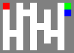

## This a Maze Agent Solver

### Agent :
    - Agent will able to move through the maze finally it will find the path to goal.

### Maze :
    - Created on top of gym environment.
    - you need to run the setup inside the gym-env for install requirements.
    - You can customize your Maze by different metrix
    - Eg for maze metrix
        [
            [1,0,1,0,1,0,0,0,1,3],
            [1,0,1,1,1,0,1,0,1,4],
            [1,0,1,0,1,0,1,0,1,0],
            [1,0,1,0,1,1,1,0,1,0],
            [1,1,1,0,1,0,1,1,1,0],
            [1,0,1,0,1,0,1,0,1,0],
            [1,0,1,0,1,0,0,0,1,0]
        ]

        - start at given index, goal-3, agent current - 4 